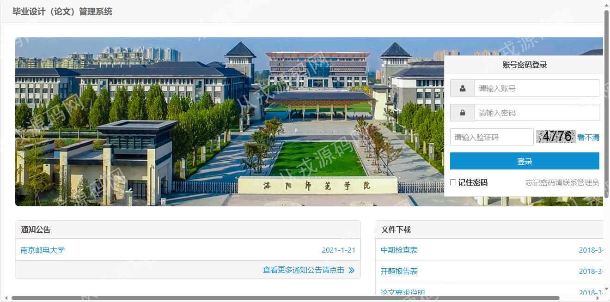
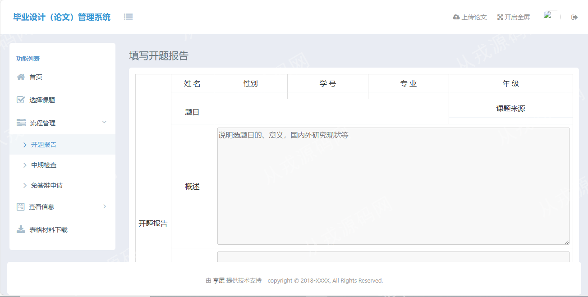

<h1 align="center">65.毕业设计（论文）管理系统</h1>

- <b>完整代码获取地址：从戎源码网 ([https://armycodes.com/](https://armycodes.com/))</b>
- <b>技术探讨、资料分享，请加QQ群：692619798</b> 
- <b>作者微信：19941326836  QQ：952045282</b> 
- <b>承接计算机毕业设计、Java毕业设计、Python毕业设计、深度学习、机器学习</b>
- <b>选题+开题报告+任务书+程序定制+安装调试+论文+答辩ppt 一条龙服务</b>
- <b>所有选题地址 ([https://github.com/YuLin-Coder/AllProjectCatalog](https://github.com/YuLin-Coder/AllProjectCatalog)) </b>

## 项目介绍
基于ssm的毕业设计（论文）管理系统：前端html、jquery、echarts、AmazeUI，后端 maven、springmvc、spring、mybatis，集成选题模块、信息管理、流程管理、文件管理等功能于一体的系统。

## 功能介绍

>毕业设计管理系统可以分为五个模块：登录模块，选题模块，信息管理模块，流程管理模块，文件管理模块。
- 该系统在技术上使用Spring+SpringMVC+MyBatis整合框架作为后台开发框架，AmazeUI作为前端开发框架。
  并使用Ehcache作为项目的缓存，druid作为项目的数据库连接池，使用FreeMarker实现word的导出，使用Shiro完成项目的登录认证，数据库使用的则是MySQL。
- 该系统可以分为三类角色：学生，教师，教务管理员。
- 该系统前端界面使用纯HTML实现，与后台的交互则都是通过Ajax完成。
> 登录模块
- 登录模块主要完成教务管理员，教师，学生用户的登录功能，每个角色登录之后会看到不同的操作界面。
> 选题模块
- 选题模块主要完成师生双选这一业务流程。
> 信息管理模块
- 信息管理模块主要完成对各种信息的crud操作。
> 流程管理模块
- 流程管理主要完成对开题报告，中期检查，免答辩申请，验收/答辩，论文审核，盲审的流程的管理。
> 文件管理模块
- 文件管理模块主要对文件的上传与下载。

## 环境

- <b>IntelliJ IDEA 2021.3</b>

- <b>Mysql 5.7.26</b>

- <b>Tomcat 7.0.73</b>

- <b>JDK 1.8</b>

## 运行截图

